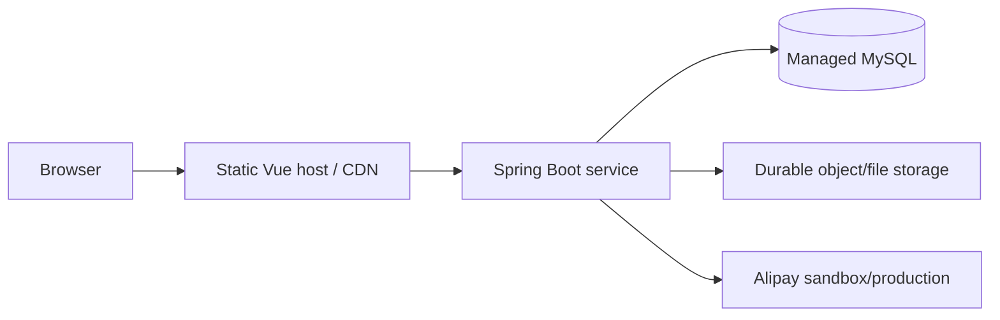

# Deployment and Operations

## 1. Current status

The backend packages successfully and the frontend produces a production
bundle. The repository now contains Railway and Vercel production configuration,
but creating the live services still requires the repository owner's Railway,
Vercel and GitHub accounts.

## 2. Local environment

Prerequisites:

- JDK 8
- Maven 3.8+
- Node.js 18 and npm
- MySQL 8

### Database

Create the database and import the supplied coursework seed:

```bash
mysql -u root -p -e "CREATE DATABASE IF NOT EXISTS xm_secondhand CHARACTER SET utf8mb4"
mysql -u root -p xm_secondhand < xm-secondhand.sql
```

If the dump expects the original `xm-secondhand` schema name, either create that
schema or update `DB_URL` consistently.

### Backend configuration

Set environment variables documented in `.env.example`. At minimum:

```text
DB_URL
DB_USERNAME
DB_PASSWORD
```

Alipay values are optional unless testing the sandbox payment flow.

Run:

```bash
mvn clean verify
mvn spring-boot:run
```

The API listens on `http://localhost:9090` by default.

### Frontend

On the Frontend branch:

```bash
npm ci
npm test
npm run serve
```

Set `VUE_APP_BASEURL=http://localhost:9090` in a local ignored environment file
or shell environment.

## 3. Production topology



Recommended production characteristics:

- HTTPS for the frontend and API;
- restricted database network access;
- secrets stored in host secret settings;
- persistent object storage rather than container-local uploads;
- health monitoring and backups;
- sandbox payment keys for assessment unless production approval exists.

## 4. Release checklist

- [x] Backend compiles, tests and packages locally.
- [x] Frontend tests and production build complete locally.
- [x] CI workflow is version controlled.
- [x] Current source contains environment placeholders rather than live keys.
- [ ] Previously exposed database/payment credentials are rotated.
- [ ] Hosted MySQL and durable upload storage are provisioned.
- [ ] Backend and frontend are deployed with HTTPS.
- [ ] Smoke test covers all 12 user stories.
- [ ] Demonstration evidence is captured.
- [ ] Genuine client acceptance is recorded.

The unchecked items are tracked in
[Issue #27](https://github.com/S13863709935/CP3407/issues/27).

## 5. Railway backend and MySQL walkthrough

### Create the project and database

1. Sign in to Railway with the GitHub account that owns the repository.
2. Create a new empty project.
3. Select **New -> Database -> MySQL** and wait for the MySQL service to start.
4. Select **New -> GitHub Repo**, choose `S13863709935/CP3407`, and name the
   service `backend`.
5. In the backend service settings, set the production branch to `Backend`.
   The repository root is already the Maven application, so leave the root
   directory empty.

Railway reads `railway.json`, builds the Maven package, starts the Spring Boot
JAR, and checks `/` before routing traffic to the new deployment.

### Configure backend variables

Open the backend service's **Variables** tab and add the following. These are
Railway reference variables; do not copy the actual database password into the
repository.

```text
DB_URL=jdbc:mysql://${{MySQL.MYSQLHOST}}:${{MySQL.MYSQLPORT}}/${{MySQL.MYSQLDATABASE}}?useUnicode=true&characterEncoding=utf-8&allowMultiQueries=true&useSSL=false&serverTimezone=GMT%2b8&allowPublicKeyRetrieval=true
DB_USERNAME=${{MySQL.MYSQLUSER}}
DB_PASSWORD=${{MySQL.MYSQLPASSWORD}}
APP_PUBLIC_URL=https://${{RAILWAY_PUBLIC_DOMAIN}}
UPLOAD_DIR=/data/files
FRONTEND_URL=https://YOUR-FRONTEND.vercel.app
```

Leave the Alipay variables empty unless the sandbox credentials have been
rotated and are ready to use.

### Preserve uploaded files

1. Right-click the Railway project canvas and select **New Volume**.
2. Attach it to the `backend` service.
3. Set its mount path to `/data`.

The Railway start command copies missing repository seed images into
`/data/files` without overwriting existing files. Future user uploads remain on
the volume across redeployments.

### Create the backend domain

Open **backend -> Settings -> Networking** and click **Generate Domain**. Save
the resulting `https://...up.railway.app` address. Redeploy the backend after
all variables have been staged.

### Import the database

Install the Railway CLI and a local MySQL client, link the local backend folder
to the Railway project, and run:

```text
railway connect MySQL
```

Inside the MySQL prompt, select the database shown by the Railway MySQL
variables and import the dump:

```sql
USE railway;
SOURCE D:/CP3407/xm-secondhand/springboot/xm-secondhand.sql;
```

Replace `railway` if `MYSQLDATABASE` has another value. Then edit the first two
URL variables in `docs/production-url-migration.sql` and execute that script in
the same prompt:

```sql
SOURCE D:/CP3407/xm-secondhand/springboot/docs/production-url-migration.sql;
```

This changes seed image and post links from `localhost` to the public domains.

## 6. Vercel frontend walkthrough

1. Sign in to Vercel with GitHub and select **Add New -> Project**.
2. Import `S13863709935/CP3407`.
3. Select the `Frontend` production branch. If Vercel initially chooses another
   branch, change it under **Settings -> Environments -> Production -> Branch
   Tracking**.
4. Choose the Vue.js preset.
5. Set **Build Command** to `npm run build`.
6. Set **Output Directory** to `dist`.
7. Add the production environment variable:

```text
VUE_APP_BASEURL=https://YOUR-BACKEND.up.railway.app
```

8. Deploy and save the generated `https://...vercel.app` URL.
9. Return to Railway, replace `FRONTEND_URL` with the actual Vercel URL, and
   redeploy the backend.
10. If the URL migration script was executed with a placeholder frontend URL,
    correct `@frontend_url` and execute the script again.

`vercel.json` sends Vue Router history-mode routes such as `/front/home` back
to `index.html`, while the built assets remain served by Vercel.

## 7. Public smoke test and evidence

Use an incognito browser window and verify:

1. the Vercel URL opens without a login prompt from the hosting provider;
2. registration and login work;
3. categories, search and item details load;
4. an uploaded image still works after redeploying the backend;
5. favourites, comments, orders, listing statuses and feedback work;
6. chat connects over `wss://`;
7. the Railway `/` endpoint returns a successful JSON response.

Capture the Vercel home page, Railway deployment success, hosted MySQL tables,
and the completed smoke-test checklist as assessment evidence. Do not expose
database passwords or payment keys in screenshots.
