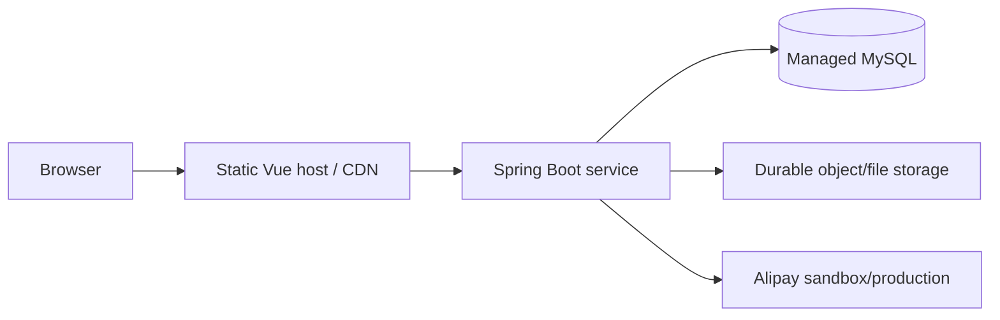

# Deployment and Operations

## 1. Current status

The backend packages successfully and the frontend produces a production
bundle. A public deployment has not yet been created because it requires owner
accounts, newly rotated credentials, a hosted MySQL database, and an assessor
access decision.

## 2. Local environment

Prerequisites:

- JDK 8
- Maven 3.8+
- Node.js 18 and npm
- MySQL 8

### Database

Create the database and import the supplied coursework seed:

```bash
mysql -u root -p -e "CREATE DATABASE IF NOT EXISTS xm_secondhand CHARACTER SET utf8mb4"
mysql -u root -p xm_secondhand < xm-secondhand.sql
```

If the dump expects the original `xm-secondhand` schema name, either create that
schema or update `DB_URL` consistently.

### Backend configuration

Set environment variables documented in `.env.example`. At minimum:

```text
DB_URL
DB_USERNAME
DB_PASSWORD
```

Alipay values are optional unless testing the sandbox payment flow.

Run:

```bash
mvn clean verify
mvn spring-boot:run
```

The API listens on `http://localhost:9090` by default.

### Frontend

On the Frontend branch:

```bash
npm ci
npm test
npm run serve
```

Set `VUE_APP_BASEURL=http://localhost:9090` in a local ignored environment file
or shell environment.

## 3. Production topology



Recommended production characteristics:

- HTTPS for the frontend and API;
- restricted database network access;
- secrets stored in host secret settings;
- persistent object storage rather than container-local uploads;
- health monitoring and backups;
- sandbox payment keys for assessment unless production approval exists.

## 4. Release checklist

- [x] Backend compiles, tests and packages locally.
- [x] Frontend tests and production build complete locally.
- [x] CI workflow is version controlled.
- [x] Current source contains environment placeholders rather than live keys.
- [ ] Previously exposed database/payment credentials are rotated.
- [ ] Hosted MySQL and durable upload storage are provisioned.
- [ ] Backend and frontend are deployed with HTTPS.
- [ ] Smoke test covers all 12 user stories.
- [ ] Demonstration evidence is captured.
- [ ] Genuine client acceptance is recorded.

The unchecked items are tracked in
[Issue #27](https://github.com/S13863709935/CP3407/issues/27).
