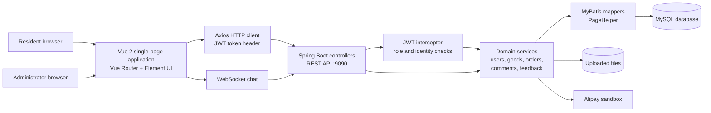
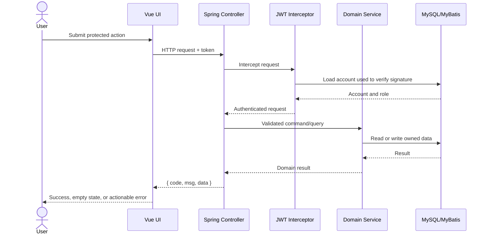
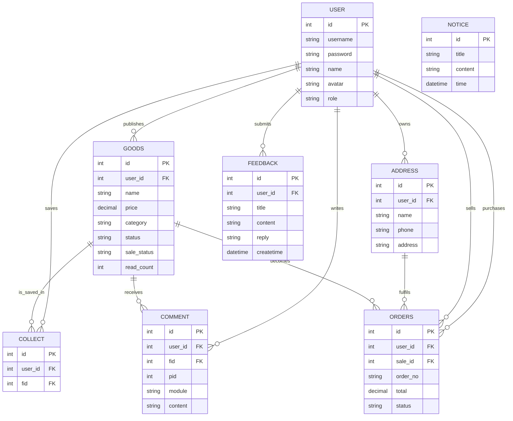
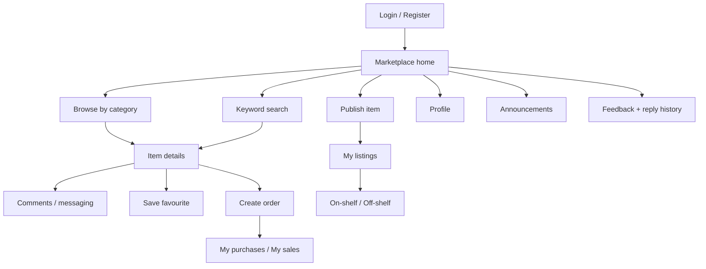

# System Design

## 1. Design goals

The system supports accountable local second-hand trading while keeping the
first release achievable within a 14.5 developer-day budget. The design
separates the browser UI, HTTP/WebSocket API, business services, persistence,
and external integrations so each area can be changed and tested independently.

The main quality goals are:

1. authenticated and role-aware trading;
2. clear ownership of listings, orders, favourites, and feedback;
3. a simple deployment model appropriate for a student project;
4. traceability from every delivered user story to a UI route and API;
5. graceful handling of empty results and unavailable external services.

## 2. Architectural design

### Component responsibilities

| Component | Responsibility | Design justification |
|---|---|---|
| Vue views and router | User journeys, form validation, state presentation | Keeps resident/admin interfaces responsive and route-oriented |
| Axios request wrapper | Base URL, JWT header, response/error handling | Prevents repeated networking code in views |
| Spring controllers | Stable HTTP contract and response envelope | Keeps transport concerns separate from business rules |
| JWT interceptor | Authentication before protected controllers execute | Central enforcement is less error-prone than checks in each endpoint |
| Services | Ownership, defaults, workflow and aggregation rules | Business behaviour can be unit tested without a web server |
| MyBatis mappers | Explicit SQL and object mapping | Suitable for the existing relational schema and query-focused application |
| MySQL | Persistent transactional data | Orders, users and listings require relational consistency |
| File store | Item images and avatars | Separates binary data from relational records |
| Alipay adapter | Optional sandbox payment entry | Isolates an external service from the core marketplace flow |

## 3. Request and trust flow

Credentials and payment keys are environment variables. The current source
contains no live values, but every value exposed in earlier history must still
be rotated by the repository owner.

## 4. Database design

The following logical ER model focuses on the tables used by the 12-story
release.

The supplied SQL dump currently represents relationships with identifier
columns rather than declared database foreign-key constraints. This reduces
import friction but permits orphaned data. A production migration should add
foreign keys after existing seed data is validated.

### Status design

`goods.status` represents administrator approval. `goods.sale_status`
represents seller-controlled publication. They are deliberately separate:

| Concern | Values | Owner |
|---|---|---|
| Audit status | Pending, Approved, Rejected | Administrator |
| Publication status | `Listed`, `Off-shelf` | Listing owner |
| Order status | Pending Payment, To Ship, To Receive, Completed, Cancelled | Buyer/seller workflow |

Only approved and `Listed` goods are returned by the public marketplace query.
Legacy publication values are normalised at both UI and service boundaries.

## 5. Interface design

### Interface principles

- Element UI provides consistent form, table, dialog and feedback patterns.
- Resident and administrator routes share visual components but keep tasks
  separated.
- Empty searches resolve to an empty list and zero total rather than an
  undefined collection.
- Publication controls show friendly labels while sending canonical values.
- Destructive actions require confirmation.
- Important transaction states are visible in the order list.

The repository contains the implemented interface rather than an external
interactive prototype. An assessor-facing prototype made with the required
online prototyping tool remains an explicit owner action in Issue #27.

## 6. Key decisions and trade-offs

| Decision | Benefit | Trade-off / follow-up |
|---|---|---|
| Vue 2 + Element UI | Fast implementation and consistent widgets | Older ecosystem; plan a future Vue 3 migration |
| Spring Boot layered API | Familiar separation and testable controllers/services | Some legacy services still rely on static request context |
| MyBatis | SQL remains visible and tuneable | Relationships and validation require discipline |
| JWT signed with account password | Tokens invalidate after a password change | Production should use a dedicated rotated signing secret |
| Local file storage | Simple coursework setup | Production requires durable object storage |
| Environment-based secrets | Current commits contain no live credentials | Previously exposed values must be revoked and history reviewed |
